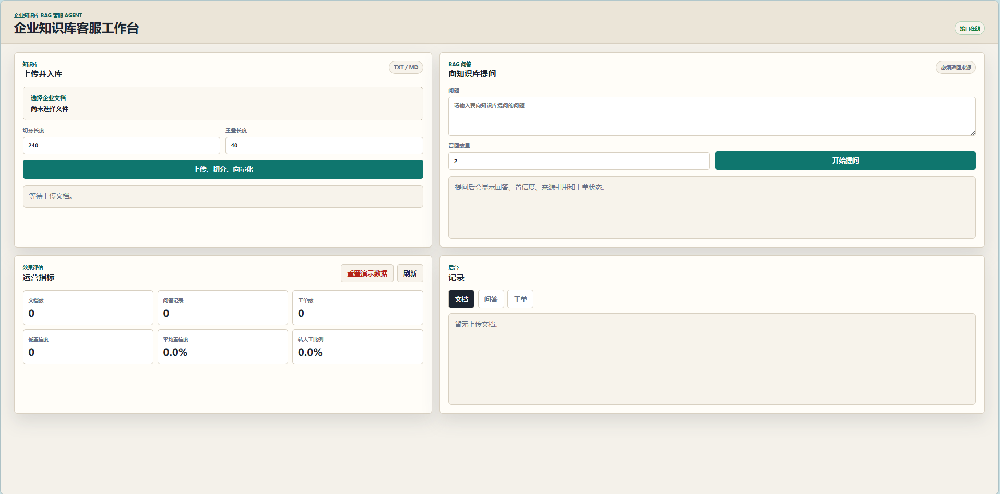
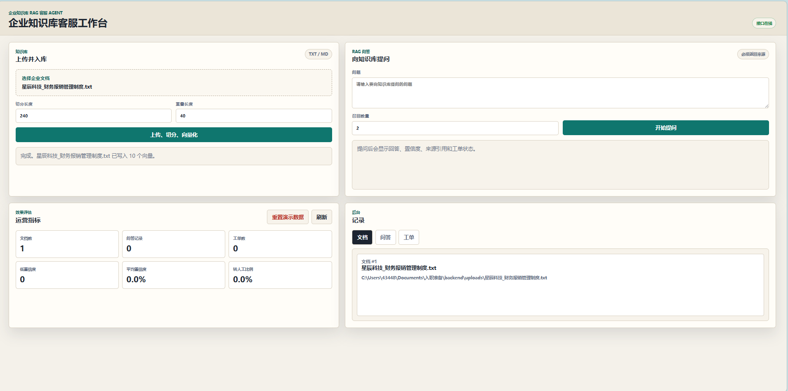
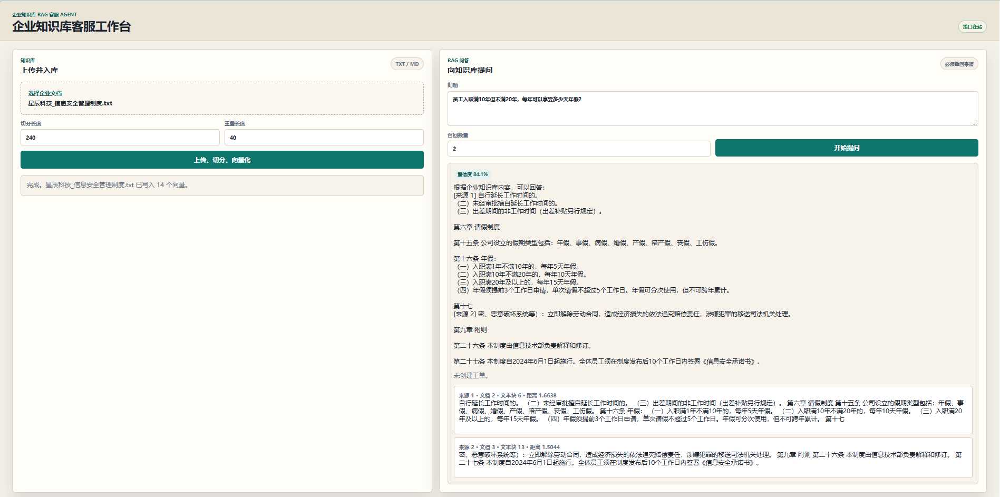
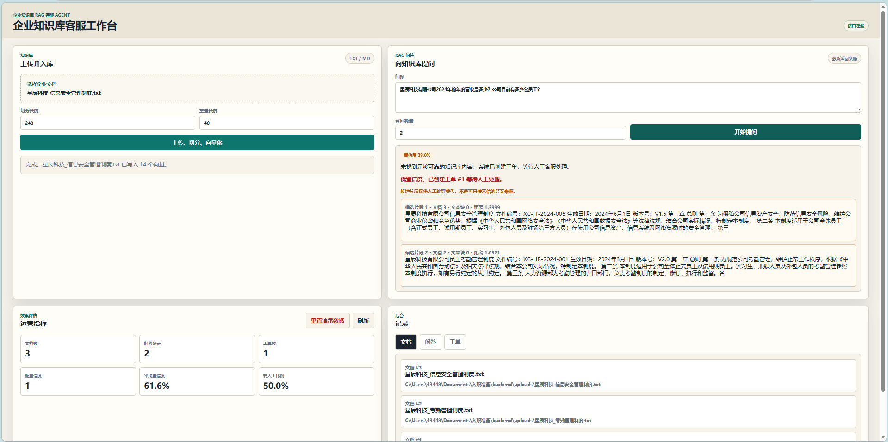
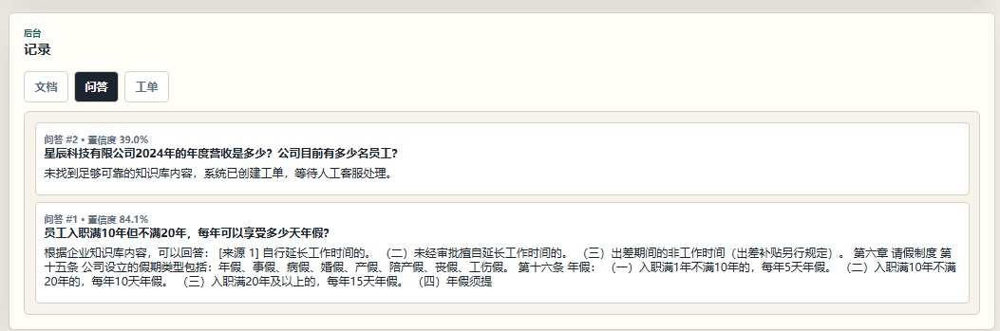
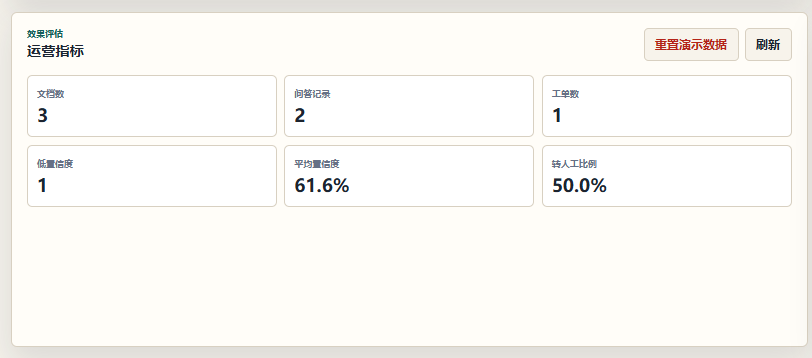

# Enterprise Knowledge Base RAG + Ticket Agent

这是一个企业知识库 RAG 与工单客服 Agent 技术展示项目。项目重点不是普通聊天机器人，而是展示一条完整、可运行、可复现的企业知识库问答工程链路。

当前版本已经完成主要能力：多格式文档解析、文本切分、Embedding、Chroma 向量检索、DeepSeek RAG 生成、来源引用、低置信度自动转工单、后台记录、运营指标、批量评测报告和 Docker 一键启动。

## Why This Project Exists

企业知识库系统不能只返回一个“看起来合理”的回答。一个可落地的 RAG 系统需要处理文档入库、检索、生成、可信度控制、人工兜底和效果评估。

本项目实现的核心链路：

```text
文档上传 -> 文本切分 -> Embedding -> 向量检索 -> RAG 回答 -> 来源引用 -> 低置信度转工单 -> 后台记录 -> 效果评估
```

## Feature Highlights

- 文档上传：支持 `.txt`、`.md`、`.pdf`、`.docx` 企业知识库文档。
- 文本切分：支持配置切分长度和重叠长度，降低长文档检索失真。
- Embedding + Chroma：将文本块写入向量库，支持基于问题的相似度检索。
- DeepSeek RAG 回答：检索结果可信时调用 DeepSeek 生成自然语言回答。
- 来源引用：返回答案、置信度和来源片段，避免黑盒式回答。
- 低置信度转工单：知识库无法可靠回答时自动创建人工客服工单。
- 候选片段提示：低置信度时展示候选片段，仅供人工处理参考。
- 后台记录：查看文档、问答、工单记录。
- 效果评估：统计文档数、问答数、工单数、平均置信度和转人工比例。
- 批量评测：基于 JSON 问题集生成 Markdown 评测报告。
- 演示数据重置：一键清空文档、问答、工单和向量索引，保证演示流程可复现。

## Capability Matrix

| 能力 | 当前实现 |
| --- | --- |
| 文档入库 | 支持 TXT、Markdown、PDF、DOCX |
| 文本处理 | 可配置切分长度和重叠长度 |
| 向量检索 | Chroma Top K 相似度检索 |
| 生成回答 | DeepSeek `deepseek-v4-flash`，无 Key 时自动回退 |
| 可信控制 | 低置信度和事实缺失场景自动转工单 |
| 可解释性 | 返回置信度、来源片段和候选片段 |
| 后台运营 | 文档、问答、工单记录和运营指标 |
| 效果评测 | 批量评测脚本和 Markdown 评测报告 |
| 工程化 | Docker Compose 一键启动 |

## Technical Materials

- 架构说明：[docs/architecture.md](docs/architecture.md)
- 技术展示材料：[docs/technical_showcase.md](docs/technical_showcase.md)
- 最终检查清单：[docs/final_checklist.md](docs/final_checklist.md)
- 功能截图目录：[docs/screenshots/](docs/screenshots/)
- 批量评测报告：[docs/evaluation/evaluation_report.md](docs/evaluation/evaluation_report.md)

## Screenshots

### 1. 重置后的空首页

系统支持一键清空演示数据，方便每次从干净状态开始验证。



### 2. 文档上传、切分、向量化

上传企业制度文档后，系统自动完成保存文档、文本切分和 Chroma 向量写入。



### 3. RAG 回答与来源引用

知识库中存在可靠答案时，系统返回回答、置信度和来源片段。



### 4. 低置信度自动转工单

当问题超出知识库范围时，系统不强行回答，而是创建人工客服工单。



### 5. 后台问答记录

每次问答都会进入后台记录，便于审计、复盘和效果评估。



### 6. 运营指标

系统统计文档数、问答数、工单数、低置信度数量、平均置信度和转人工比例。



## Demo Flow

1. 打开 `http://localhost:8000/`，点击“重置演示数据”，让系统回到空状态。
2. 上传企业制度文档，使用默认切分长度 `240`、重叠长度 `40`，点击“上传、切分、向量化”。
3. 提问文档内问题，例如“员工入职满10年但不满20年，每年可以享受多少天年假？”，观察答案、置信度和来源引用。
4. 提问文档外问题，例如“公司 2024 年的年度营收是多少？目前有多少名员工？”，观察低置信度转工单。
5. 查看后台“问答”和“工单”记录，确认每次问答和转人工都有记录。
6. 查看“运营指标”，观察问答数、工单数、平均置信度和转人工比例。

## Engineering Value

- 完整链路：从文档入库到 RAG 回答，再到转工单和指标评估。
- 可解释：每次回答都返回来源片段和置信度。
- 不乱答：低置信度或事实缺失时自动转人工。
- 大模型增强：高置信度检索结果可交给 DeepSeek 生成更自然的客服回复。
- 可运营：后台能查看文档、问答、工单和评估指标。
- 可评测：提供批量评测脚本，统计关键词命中率、转人工准确率和平均置信度。
- 可复现：提供 Docker 启动、截图、架构说明、演示脚本和评测报告。

## Tech Stack

- Backend: Python, FastAPI
- Database: SQLite, 可升级 PostgreSQL
- Vector Store: Chroma
- LLM: DeepSeek API, 默认模型 `deepseek-v4-flash`
- Document Parsing: pypdf, python-docx
- Frontend: HTML, CSS, JavaScript
- Engineering: Docker, Docker Compose

## Local Backend Run

进入后端目录：

```bash
cd backend
```

启动服务：

```bash
python -m uvicorn app.main:app --reload
```

访问健康检查：

```text
http://localhost:8000/health
```

预期返回：

```json
{"status":"ok"}
```

访问前端工作台：

```text
http://localhost:8000/
```

## Docker One-Command Run

如果本机已安装 Docker Desktop，可以在项目根目录直接执行：

```bash
docker compose up --build
```

启动完成后访问：

```text
http://localhost:8000/
```

健康检查：

```text
http://localhost:8000/health
```

如需启用 DeepSeek 生成答案，在项目根目录创建本地 `.env` 文件：

```env
DEEPSEEK_API_KEY=你的 DeepSeek API Key
DEEPSEEK_BASE_URL=https://api.deepseek.com
DEEPSEEK_MODEL=deepseek-v4-flash
DEEPSEEK_TIMEOUT_SECONDS=30
```

`.env` 已被 `.gitignore` 忽略，不会上传到 GitHub。

数据持久化目录：

- SQLite 数据库：`backend/data/app.db`
- Chroma 向量库：`backend/data/chroma`
- 上传文件：`backend/uploads`

停止服务：

```bash
docker compose down
```

## Run Tests

```bash
cd backend
python -m unittest discover -s tests -v
```

## Run Batch Evaluation

先确保已经上传并向量化企业制度文档，然后在后端目录执行：

```bash
cd backend
python scripts/evaluate_rag.py
```

默认问题集：

```text
docs/evaluation/rag_eval_questions.json
```

默认输出报告：

```text
docs/evaluation/evaluation_report.md
```

评测脚本会统计：

- 总问题数
- 通过率
- 关键词命中率
- 低置信度转人工准确率
- 平均置信度
- 平均来源数量

## Deployment Notes

当前项目已经支持 Docker Compose，本地和服务器部署流程基本一致：

1. 在服务器安装 Docker 和 Docker Compose。
2. 拉取 GitHub 仓库代码。
3. 进入 `enterprise-rag-ticket-agent` 目录。
4. 创建 `.env`，配置 `DEEPSEEK_API_KEY`。
5. 执行 `docker compose up --build -d` 后台启动。
6. 开放服务器 `8000` 端口，或通过 Nginx 反向代理到域名。

部署时不要把 `.env`、`backend/data/`、`backend/uploads/` 提交到 GitHub。生产环境建议将 SQLite 升级为 PostgreSQL，并给后台接口增加登录鉴权。

## Main APIs

| Method | Endpoint | Purpose |
| --- | --- | --- |
| `GET` | `/health` | 健康检查 |
| `POST` | `/documents/upload` | 上传文档 |
| `POST` | `/documents/{document_id}/chunks` | 文本切分 |
| `POST` | `/documents/{document_id}/embeddings` | 写入向量库 |
| `GET` | `/search` | 向量检索 |
| `POST` | `/rag/answer` | RAG 问答 |
| `GET` | `/tickets` | 工单列表 |
| `GET` | `/admin/documents` | 后台文档记录 |
| `GET` | `/admin/qa-records` | 后台问答记录 |
| `GET` | `/admin/metrics` | 运营指标 |
| `POST` | `/admin/reset-demo` | 重置演示数据 |

## Project Structure

```text
.
├── backend/
│   ├── app/
│   ├── tests/
│   ├── Dockerfile
│   └── requirements.txt
├── docs/
│   ├── architecture.md
│   ├── technical_showcase.md
│   ├── evaluation/
│   └── screenshots/
├── frontend/
│   ├── index.html
│   ├── styles.css
│   └── app.js
├── docker-compose.yml
└── README.md
```

## Next Engineering Improvements

- 接入真实 Embedding 模型，例如 BGE、Qwen Embedding 或 OpenAI Embedding。
- 增加工单状态流转，例如 `open`、`processing`、`resolved`。
- 增加管理员登录和权限控制。
- 增加人工标注反馈，用于评估和优化 RAG 回答质量。
- 将 SQLite 升级为 PostgreSQL。
- 部署到云服务器，并接入统一技术演示站点。
