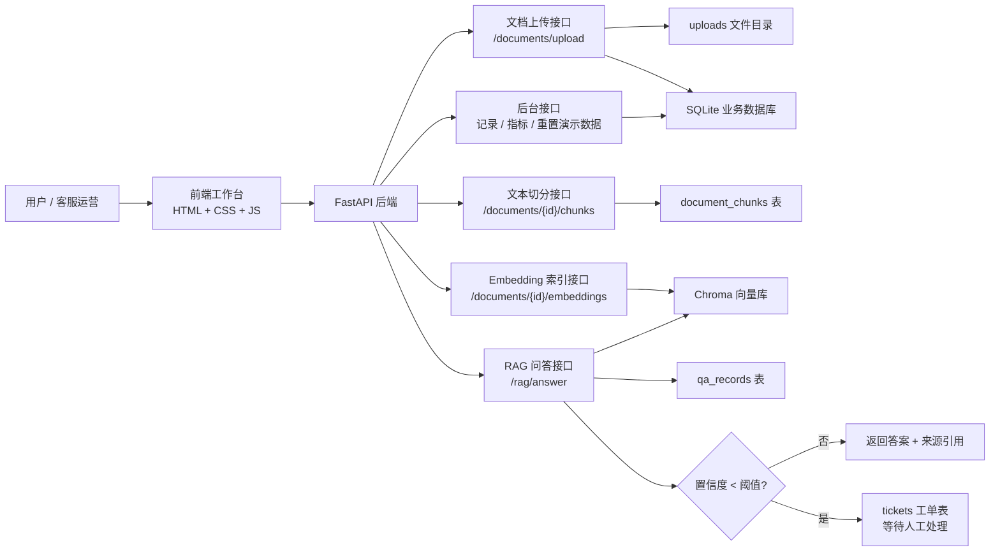

# 企业知识库 RAG + 工单客服 Agent 架构说明

## 项目定位

这个项目不是普通聊天机器人，而是一个企业知识库客服 Agent。它展示的是完整 RAG 落地链路：文档入库、文本切分、Embedding、向量检索、带来源回答、低置信度转工单、后台记录和效果评估。

## 总体架构图



## 核心流程

### 1. 知识库入库

```text
企业制度文档 -> 上传 -> 保存文件 -> 写入 documents 表 -> 文本切分 -> 写入 document_chunks 表 -> Embedding -> 写入 Chroma
```

做什么：把企业知识库文档变成可检索的文本块和向量。

为什么做：RAG 不能直接拿整篇长文档检索，必须先把文档拆成粒度合适的文本块。

怎么验证：上传 `.txt`、`.md`、`.pdf` 或 `.docx` 后，页面显示文本块数量和向量写入数量，后台“文档”记录增加。

### 2. RAG 问答

```text
用户提问 -> 向量检索 Top K 文本块 -> 计算置信度 -> 生成回答 -> 返回来源引用 -> 保存问答记录
```

做什么：根据知识库中检索到的片段回答问题，并展示来源。

为什么做：企业客服场景要求答案可追溯，不能只给一个没有依据的自然语言回复。

怎么验证：问“年假多少天”“报销标准是多少”等文档内问题，回答区应显示答案、置信度和来源片段。

### 3. 低置信度转工单

```text
用户提问 -> 检索结果不足或事实缺失 -> 置信度低于阈值 -> 创建工单 -> 候选片段仅供人工处理参考
```

做什么：当知识库无法可靠回答时，系统自动创建人工客服工单。

为什么做：企业系统宁可转人工，也不能编造答案。这个能力体现 Agent 的流程控制和风险控制。

怎么验证：问“公司年度营收是多少”“办公地址在哪里”等文档外问题，页面应显示低置信度并创建工单。

### 4. 后台记录与评估指标

```text
文档记录 + 问答记录 + 工单记录 -> 运营指标 -> 演示数据重置
```

做什么：记录每次问答和转人工结果，并统计文档数、问答数、工单数、平均置信度、转人工比例。

为什么做：真实 RAG 项目需要可观察性，面试官会关注系统是否能评估效果。

怎么验证：多问几次问题后刷新指标，问答数和工单数应随操作变化。

## 主要模块

| 模块 | 文件 | 作用 |
| --- | --- | --- |
| FastAPI 应用入口 | `backend/app/main.py` | 注册 API 路由、初始化数据库、托管前端静态文件 |
| 文档接口 | `backend/app/api/documents.py` | 上传、切分、向量化 |
| RAG 接口 | `backend/app/api/rag.py` | 接收问题并返回答案、来源、置信度和工单状态 |
| 向量检索 | `backend/app/services/vector_store.py` | Chroma 写入、检索、中文候选重排 |
| RAG 服务 | `backend/app/services/rag_service.py` | 置信度计算、事实缺失检查、低置信度转工单 |
| 数据库 | `backend/app/db/database.py` | SQLite 表结构和记录读写 |
| 前端工作台 | `frontend/index.html`、`frontend/app.js`、`frontend/styles.css` | 上传、问答、后台记录、指标展示 |

## 数据表

- `documents`: 保存上传文档的文件名、路径和创建时间。
- `document_chunks`: 保存文档切分后的文本块、块序号和来源文档 ID。
- `qa_records`: 保存用户问题、RAG 回答、置信度和来源引用。
- `tickets`: 保存低置信度问题转人工处理的工单。

## 当前版本边界

- 当前 Embedding 是本地确定性向量，不依赖 API Key，适合先展示工程链路。
- 生产版本可以替换为 OpenAI Embedding、BGE、Qwen Embedding 等真实语义模型。
- 当前前端是静态 HTML/CSS/JS，便于快速展示；后续可升级 React 或 Next.js。
